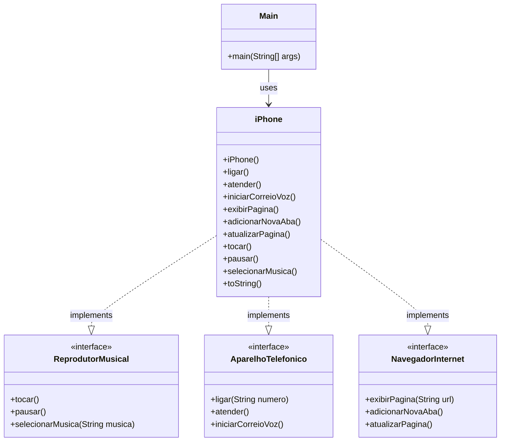

# 📱 Desafio POO DIO - Sistema de Modelagem iPhone

Um projeto desenvolvido em Java que demonstra os conceitos fundamentais da Programação Orientada a Objetos através da modelagem de um iPhone e suas funcionalidades principais.

## 📋 Sobre o Projeto

Este projeto foi criado como parte de um desafio da Digital Innovation One (DIO) para aplicar os pilares da POO na modelagem de um sistema que representa as funcionalidades básicas de um iPhone:

- **Reprodutor Musical** 🎵
- **Aparelho Telefônico** 📞  
- **Navegador na Internet** 🌐

## 🎯 Objetivos de Aprendizado

- Aplicar conceitos de **Abstração** e **Encapsulamento**
- Implementar **Herança** e **Polimorfismo**
- Utilizar **Interfaces** para definir contratos
- Praticar **Design Patterns** e boas práticas de código
- Modelar sistemas do mundo real usando POO

## 🏗️ Arquitetura do Projeto

### Estrutura de Pacotes
```
src/
├── main/
│   └── java/
│       ├── interfaces/
│       │   ├── ReprodutorMusical.java
│       │   ├── AparelhoTelefonico.java
│       │   └── NavegadorInternet.java
│       ├── model/
│       │   └── iPhone.java
│       └── Main.java
```

### Princípios POO Aplicados

#### 🔒 Encapsulamento
- Atributos privados com métodos getters/setters apropriados
- Controle de acesso às funcionalidades internas do dispositivo

#### 🎭 Abstração
- Interfaces bem definidas que abstraem comportamentos específicos
- Separação clara entre o que o objeto faz e como ele faz

#### 🧬 Herança
- Estrutura hierárquica bem definida para extensibilidade
- Reutilização de código através de classes base

#### 🔄 Polimorfismo
- Implementação de múltiplas interfaces pela classe iPhone
- Capacidade de tratar o objeto de diferentes formas

## 🛠️ Funcionalidades Implementadas

### 🎵 Reprodutor Musical
- `tocar()` - Inicia a reprodução de música
- `pausar()` - Pausa a música atual
- `selecionarMusica(String musica)` - Seleciona uma música específica

### 📞 Aparelho Telefônico
- `ligar(String numero)` - Realiza chamadas telefônicas
- `atender()` - Atende chamadas recebidas
- `iniciarCorreioVoz()` - Acessa o correio de voz

### 🌐 Navegador na Internet
- `exibirPagina(String url)` - Navega para uma página web
- `adicionarNovaAba()` - Abre uma nova aba no navegador
- `atualizarPagina()` - Recarrega a página atual

## 🚀 Como Executar

### Pré-requisitos
- Java 8 ou superior
- IDE de sua preferência (IntelliJ IDEA, Eclipse, VS Code)

### Passos para execução
1. Clone o repositório:
```bash
git clone https://github.com/ArturLLopes/Desafio-POO-DIO.git
```

2. Navegue até o diretório do projeto:
```bash
cd Desafio-POO-DIO
```

3. Compile e execute:
```bash
javac src/main/java/*.java src/main/java/**/*.java
java -cp src/main/java Main
```

## 💡 Boas Práticas Implementadas

### Convenções de Nomenclatura
- **Classes**: PascalCase (`iPhone`, `ReprodutorMusical`)
- **Métodos e variáveis**: camelCase (`tocarMusica`, `numeroTelefone`)


### Design Patterns
- **Strategy Pattern**: Diferentes estratégias para cada funcionalidade
- **Interface Segregation**: Interfaces específicas e coesas
- **Single Responsibility**: Cada classe tem uma responsabilidade bem definida

### Organização do Código
- Separação clara entre interfaces e implementações
- Documentação adequada com Javadoc
- Código limpo e legível
- Tratamento adequado de exceções


## 📊 Diagrama UML



## 🤝 Contribuindo

1. Faça um fork do projeto
2. Crie uma branch para sua feature (`git checkout -b feature/AmazingFeature`)
3. Commit suas mudanças (`git commit -m 'Add some AmazingFeature'`)
4. Push para a branch (`git push origin feature/AmazingFeature`)
5. Abra um Pull Request

## 📝 Licença

Este projeto está sob a licença MIT. Veja o arquivo [LICENSE](LICENSE) para mais detalhes.

## 👨‍💻 Autor

**Artur L. Lopes**
- GitHub: [@ArturLLopes](https://github.com/ArturLLopes)
- LinkedIn: [Seu LinkedIn](www.linkedin.com/in/arturlageslopes)

## 🙏 Agradecimentos

- [Digital Innovation One (DIO)](https://dio.me) pela proposta do desafio

---

⭐ Se este projeto te ajudou, considere dar uma estrela no repositório!
